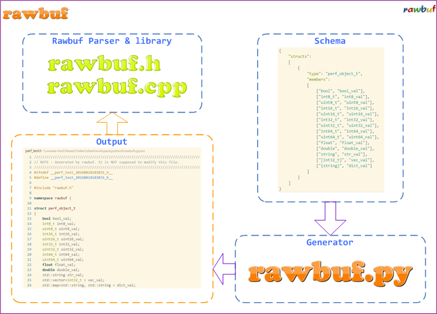
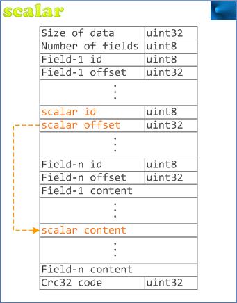
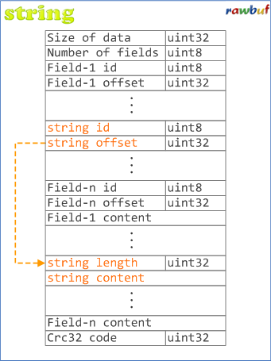
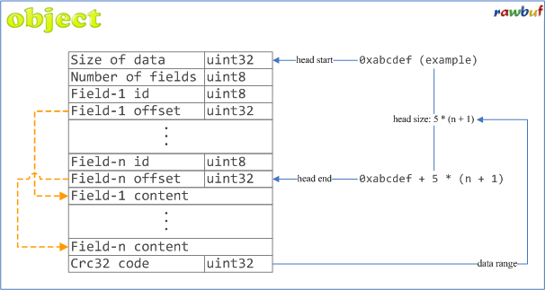
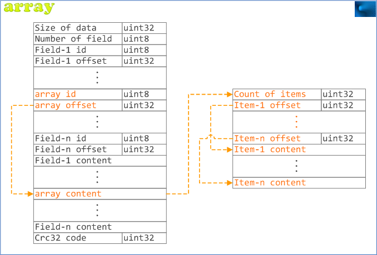
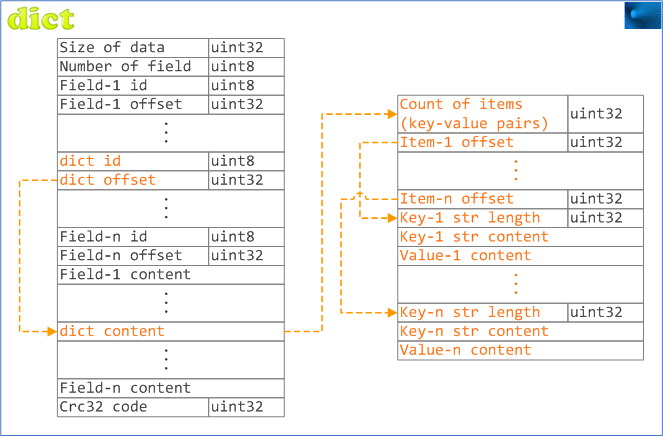

[简体中文](README_ZH.md)

# rawbuf - Scalable & Efficient Serialization Library #

`rawbuf` is a powerful tool kit used in object serialization and deserialization with **full automation** feature, all new design based on [YAS](https://github.com/jobs-github/yas). 

The design of rawbuf: 

## What is rawbuf ? ##

`rawbuf` is inspired by [flatbuffers](https://github.com/google/flatbuffers) and [slothjson](https://github.com/jobs-github/slothjson). `flatbuffers` is efficient enough but not so stupid & succinct, while `slothjson` is stupid & succinct enough but not so efficient.  That is what `rawbuf` needs to do.  
`rawbuf` uses flatbuffers-like protocol to describe data, and uses [YAS](https://github.com/jobs-github/yas) for automation. So it is faster than `slothjson` and easier than `flatbuffers`.  

Please refer to [slothjson](https://github.com/jobs-github/slothjson) for more details.  

## Features ##

* Efficient (4x faster than `slothjson`)  
* Succinct interface for people (everything can be done with just a single line of code)
* Simple, powerful code generator with full automation (not need to implement serialize/deserialize interfaces manually)
* Support optional field (easy to serialize/deserialize field optionally)
* Flexible schema (support array, dict, nested object and **nested array & dict**)
* Succinct design (no tricky C++ template technology, easy to understand), reusable, extensible (easy to support new types)
* Cross-Platform (Windows & Linux & OS X)

## Usage ##

Take C++ implement of rawbuf as an example. In the beginning, you need to add the following items to your project:

* `rawbuf`: refer to `cpp/include/rawbuf.h` and `cpp/include/rawbuf.cpp`, the library of rawbuf

**That's all the dependency**.  

Then, write a schema named `fxxx_gfw.json`:  

	{
	    "structs": 
	    [
	        {
	            "type": "fxxx_gfw_t",
	            "members": 
	            [
	                ["bool", "bool_val", "100"],
	                ["int8_t", "int8_val"],
	                ["int32_t", "int32_val"],
	                ["uint64_t", "uint64_val"],
	                ["double", "double_val", "101"],
	                ["string", "str_val"],
	                ["[int32_t]", "vec_val", "110"],
	                ["{string}", "dict_val"]
	            ]
	        }
	    ]
	}

Run command line:  

    python cpp/generator/rawbuf.py -f cpp/src/fxxx_gfw.json

It will generate `fxxx_gfw.h` and `fxxx_gfw.cpp`, which you need to add to your project.  
Then you can code like this: 

    rawbuf::fxxx_gfw_t obj_val;
    // set the value of "obj_val"
    ......
    // output as instance of "rb_buf_t"
	rawbuf::rb_buf_t rb_val = rawbuf::rb_create_buf(rawbuf::rb_sizeof(obj_val));
	bool rc = rawbuf::rb_encode(obj_val, rb_val);
	// use value of "rb_val"
	......
	rawbuf::rb_dispose_buf(rb_val); // do not forget!
    // output as file
    std::string path = "fxxx_gfw_t.bin";
    bool rc = rawbuf::rb_dump(obj_val, path);

If you don't want to serialize all fields, code like this: 

    obj_val.skip_dict_val(); // call "skip_xxx"
The same as deserialize:

	rawbuf::rb_buf_t rb_val = rawbuf::rb_create_buf(rawbuf::rb_sizeof(obj_val));
    // set the value of "rb_val"
    ......
	// load from "rb_val"
    rawbuf::fxxx_gfw_t obj_val;
	bool rc = rawbuf::rb_decode(rb_val, 0, obj_val);
	......
	rawbuf::rb_dispose_buf(rb_val); // do not forget!

    // load from file
	std::string path = "fxxx_gfw_t.bin";
    rawbuf::fxxx_gfw_t obj_val;
	bool rc = rawbuf::rb_load(path, obj_val);

After deserialized, if you need to know **whether a field is in binary buffer or not**, code like this:

    if (obj_val.rb_has_dict_val()) // call "rb_has_xxx()"
    {
         ......
    }

That's all about the usage, simple & stupid, isn't it ?  

## Supported Programming Languages ##

* C++
* C
* Go

I implement rawbuf using php & python, but not merge to master branch as the performance does not come up to expectation. Welcome contribution on other programming languages' implementation.  
* [php-alpha](https://github.com/jobs-github/rawbuf/tree/php-alpha)  
* [python-alpha](https://github.com/jobs-github/rawbuf/tree/python-alpha)  
* [php-beta](https://github.com/jobs-github/rawbuf/tree/php-beta)  
* [python-beta](https://github.com/jobs-github/rawbuf/tree/python-beta)  

Note: the performance of `beta` is better than `alpha`.  

## Implement on YAS Extension ##

Language      | Implement YAS Extension
--------------|-------------------------
C++           |         Yes
C             |         No
go            |         No
php-alpha     |         Yes
python-alpha  |         Yes
php-beta      |         No
python-beta   |         No

## Platforms ##

Platform | Description
---------|----------------------------------------------------------
Linux    | CentOS 6.x & Ubuntu 10.04 (kernel 2.6.32) GCC 4.4.7
Win32    | Windows 7, MSVC 10.0
OS X     | Mac OS X EI Capitan, GCC 4.2.1, Apple LLVM version 7.3.0

## Performance ##

## Details ##

`rawbuf` and `slothjson` share the **same design, same schema**. The difference between them is the protocol (`text` vs `binary`) and performance.

You can get all details from [here](https://github.com/jobs-github/slothjson) and [here](https://github.com/jobs-github/yas)

## Protocol ##

### scalar ###

### string ###

### object ###

### array ###

### dict ###

## License ##

`rawbuf` is licensed under [New BSD License](https://opensource.org/licenses/BSD-3-Clause), a very flexible license to use.

## Author ##

* chengzhuo (jobs, yao050421103@163.com)  

## More ##

- Yet Another Schema - [YAS](https://github.com/jobs-github/yas)  
- Object Serialization Artifact For Lazy Man - [slothjson](https://github.com/jobs-github/slothjson)  
- High-performance Distributed Storage - [huststore](https://github.com/Qihoo360/huststore)  